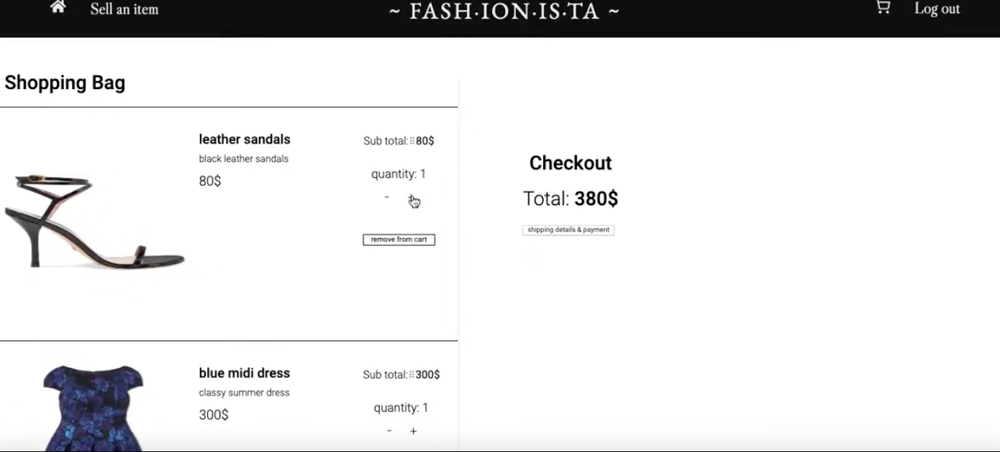
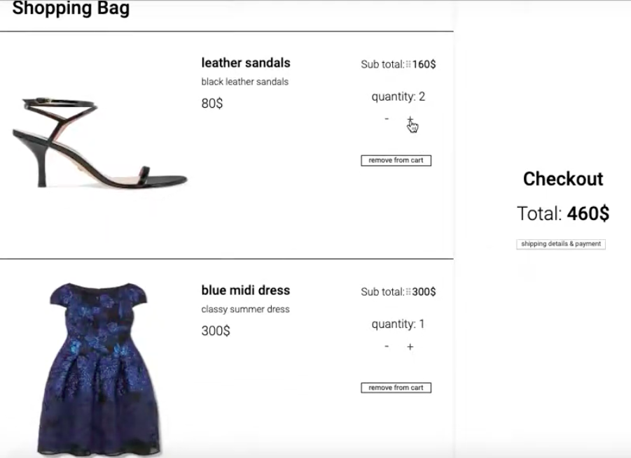
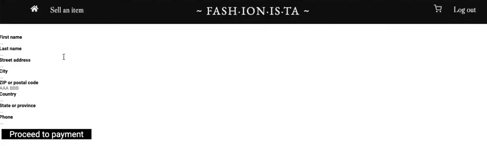
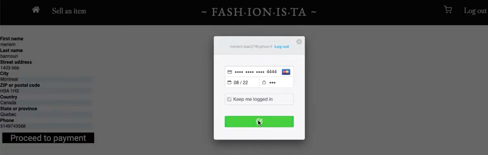

**Marketplace - Web App – team project**
---
- **Front-end :** JavaScript, React, Redux, CSS
- **Back-end :** Node.js, Express, MongoDB
- **Other tools:** Git, Github, Postman

**Alibay is an online marketplace that makes available the following functionalities:**

- signup / login
- selling new item form
- browsing items / filtering by cost and stock availability
- purchasing items / processing payments through Stripe

  *Project video available:* https://bit.ly/2kCBtFN
  
  ---
  - signup / login
  
  
  - selling new item form
   
   
   - browsing items / filtering by cost and stock availability
   
   
   
   - purchasing items / processing payments through Stripe
   
   
   
   
